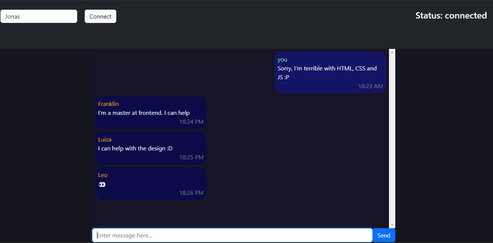
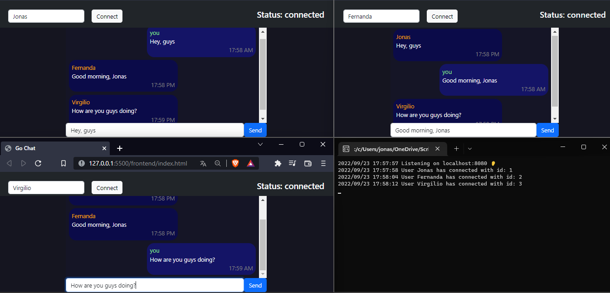

# Chat go

## Images

**This is a simple chat application made in Golang with [Websocket](http://github.com/gorilla/websocket)**

*Chatting*

*Three chats*

## How to run

### Requirements

- Go >= 1.12
- Any browser

### Running the backend

After navigating to the backend folder, use the command `go run main.go` and the server should return the message`Listening on localhost:8080 👂`

### Running the frontend

After navigating to the frontend folter, double-click the `index.html` file

sorry for the eye-bleeding `script.js` file
